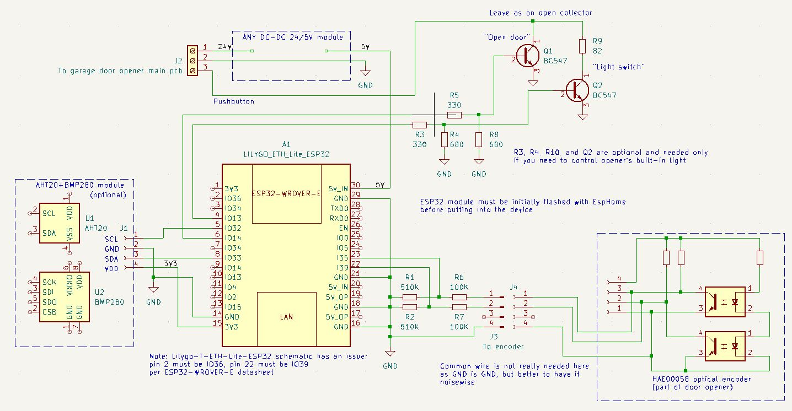

# ESPHome Garage Door Opener Controller for Devices with Optical Encoder

## Description

This is a small [ESPHome](https://esphome.io/) project designed to control and monitor a garage 
door opener using an optical encoder as a movement sensor. For example, the Precision PDS-800. 
Key features include:

- Fits entirely within the opener case, with no external wiring except for a LAN 
cable if LAN communication is used.
- No additional sensors are required to monitor door state/position.
- No relays or other switching devices are needed.
- In its minimal configuration, it requires only 3 input and 1 output pins.
- Additional ESPHome sensors can be added.
- Displays not only open/closed positions but also opening/closing movements. 
It can detect mechanical failures and when the door has been open for an extended period.
- Includes a simple Lovelace UI card for Home Assistant.

However, there are some drawbacks:

- The door state cannot be recognized until the first movement occurs.
- Modifying the opener voids its warranty.
- It requires initial setup and does not work out of the box.
- A hardware pulse counter pin is required, making it incompatible with the ESP8266.

## Warning

This project has at least medium complexity. You must have previous experience with ESPHome, 
moderate electrical knowledge, and soldering skills. You should be capable of working safely 
with circuits that may have high (>100V) voltage. There is a risk of electric hazard. 
All connections must be made while the device is fully unplugged from the power outlet.

Implementing these changes will void the warranty of the garage door opener and possibly 
the entire garage door setup. You may damage the door opener and/or the garage door setup. 
This manual may not cover all aspects, so you should apply your own knowledge and risk 
analysis if something is unclear. The software and manual are provided "as is," 
and by proceeding, you agree to take responsibility for any damage or losses—physical, 
monetary, mental, or otherwise—that may occur. The author does not hold any liability 
for any such consequences.

## How it works ##

There are some challenges while working with optical encoder in ESPHome. ESPHome does have
[rotary encoder](https://esphome.io/components/sensor/rotary_encoder) sensor, but in this
case pulses have a period of around 40ms and seems ESPHome misses some and sometimes even 
reports opposite direction during rotation if we are using just this rotary encoder 
component.

Optical sensor has a resolution of about 1 cm, so in a case of a door coming to an end position
the belt tries to drop the tension and may produce a few pulses. We need to ignore them.

After the power up the garage door has 'Unavailable' state. Once optical encoder starts to 
rotate, after first 5 pulses we decide if it is opening or closing. Then we do not care about
encoder and just count pulses on a hardware counter. We wait till pulses stop coming and if 
the number of pulses is enough to consider the door fully opened or closed we set its state,
otherwise it is a failure. If we receive only one pulse within certain period (250ms) we 
ignore it - it is just a parking.

If the door is opened for 30 mins the state is changed to 'Opened timeout'. It can be used
in some automation scripts.

The device exposes: 

- two 'hardware' buttons that connected directly to 'button' 
connector of the opener (one for the door and one for the light). Door button is not exposed
by default (see below). Light button is optional, you can remove it and not install
components for it
- two 'software' buttons for opening and closing the door. Better to use these ones
in any automation as they check the current state of the door before making an action
- `select` input for the door state
- minimum counter value - for initial set up (see below)
- optional - temperature, humidity and atmospheric pressure sensors on AHT20/BMP280 board

You can add other sensors as well, both hardware and software.

## Schematics ##

Pretty simple. DC/DC converter of 24V/5V, ESP32 module, a few discrete components.

AHT20+BMP280 module is optional, as well as the circuit for light switch.

Author's device is based on LILYGO T-ETH-Lite module as LAN connection was needed, but in
general any ESP32 module can be used. Just define proper pins in the yml file. The mandatory
thing is to assign `encoder_pulse_counter` sensor to hardware pulse counter pin. Usually it
is marked as RTC in datasheets. This pin must be connected to one of encoder's pins (does 
not really matter which of two). IO35 and IO36 on this schematic diagram.

## Setting up ##

### Assembling ###

Note: This picture is only for a reference. This particular device has some debug components 
like LED and a few resistors. It has bad connectors as well (see below). You should follow 
the schematics, not this picture.

Components for light button and ambient sensor are optional and may be not installed. Just 
remove them from yml in this case as well.

The device was made on a prototype board and used mixed wired and SMD components. As there 
is no USB connector, the device must be initially flashed with ESPHome in any way and only 
then installed in the garage opener.

### Power ###

The door opener does have a 5V power source, but it is not clear how much load it can handle.
So for safety this device is powered from 24V source via DC-DC power module. Important! Before
connecting ESP32 module to power module check its output voltage. It must be 5V +/-10%.

### Fitting inside opener case ###

Wherever you find an empty space (there is plenty of it) and convenient for you to attach it.
For LAN connector a hole in the covering should be made. Author's installation looks like

and with the cover on:

### Connection to the opener circuits ###

Warning (one more time)! Internal circuits have high (>100V) voltage. There is a risk of 
electric hazard. All connections must be made while the opener is fully unplugged from the 
power outlet. The proposed changes will void garage door opener warranty and maybe in some
cases all the garage door set up. You may damage the door opener and/or garage door, as well
as ESP32 and/or other components. If you are not sure - ask someone who has an experience in 
this stuff.

Find 24V source. It is a big electrolytic capacitor in the middle of PCB, do not mess with 
another one on the left side (if look on the photo below) which is the high voltage one. In 
any case check the voltage on the capacitor before making a connection. It should be 24-27V 
in idle. Again, measure on a working opener with all the precautions, connect only on fully 
unplugged one. 

'Button' connection is pretty straightforward - just solder a wire to the PCB pad under it.

In Precision PDS-800 the connection points are:

Locate signal wires on the optical encoder PCB.  

In Precision PDS-800 the connection points are:

Just connect them as they are, if the opening door will appear as closing in ESPHome, you
just swap those wires later.

Author's device uses screwed connectors - it is a **bad** solution. Use a connector that holds
wires in place and would not let them contact each other and other circuits. A molex connector
may be a good choice.

For other models of openers you would need (only brief instructions here, as you should 
know for sure what you are doing):
- check if bipolar transistor triggers button. Check the voltage on the button pin. Choose
the transistor accordingly
- find a power source. It may be or may be not 24V. Choose a proper DC-DC module capable
of handling input voltage
- check an amplitude and a period of pulses on the optical encoder
- measure internal resistance on the main board where optical encoder is connected.
- choose voltage divider based on the amplitude and resistance. Whole resistance of the 
divider must be at least 5 times more than the internal one. For example, in PDS-800 the 
resistance is pretty high - 100K. And the amplitude is 3.9V. So the divider is 
610K: 510K + 100K.
- based on the pulse period tweak timings in the yml file

### Debugging and Setting the Counter Value

After connecting the device to the opener, it should power up and display its UI. 
Press your opener button or click the `Garage door button` in the device UI. The door 
should start moving, and the device must recognize whether it is opening or closing. 
If it shows movement in the opposite direction, unplug the opener from the power socket
and swap the two signal wires to the optical sensor.

After the first movement, the state should change from unavailable to opened/closed, and 
encoder_debug_min_value should be updated. Note its value:

 

Open/close the door again. The value may change slightly. Leave the device for a few days 
and monitor the value periodically. It should not change more than a few pulses overall. 
If it consistently decreases, there may be an error in the assembly or optical encoder 
connection (amplitude/pulse period). In such cases, an oscilloscope might be necessary for 
troubleshooting.

After a few days, if there are no significant changes, subtract 3 from the observed value for 
safety and set it in `encoder_full_way.initial_value`. You can then comment out everything 
related to `encoder_debug_min_value` as it is no longer needed. Recompile the project and flash 
the device again.

Now it is ready for use. Monitor it for a few more days—there should be no 'Failure' states, 
and it should display states correctly.

## Home Assistant Lovelace UI card ##

The [button-card](https://github.com/custom-cards/button-card) needs to be installed, 
which can be done via HACS, for example.

If this project is compiled as is, the card should work seamlessly. Otherwise, adjust the 
entities for both the select input and buttons according to their IDs in Home Assistant.

## Support

Support is not promised, but the author will try to resolve coming issues if time allows it. 
PRs are welcome.